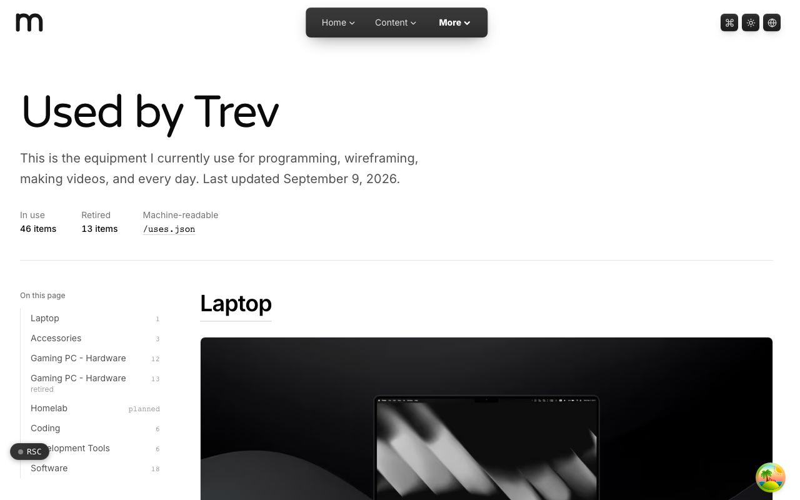

  <picture>
    <source media="(prefers-color-scheme: dark)" srcset=".github/assets/hero-dark.png">
    
  </picture>

# use.me.at

Used by Trev: the equipment I currently use for programming, wireframing, making videos, and every day.

use.me.at is Trevor McDougald's "uses" page. It lists the hardware, editor and software used day to day: laptop, accessories, gaming PC build, homelab, coding tools and Mac apps. Items are grouped into sections and marked as in use or retired, and the whole page is also published as machine-readable JSON for anyone who wants the list without the layout.

**Live:** [use.me.at](https://use.me.at)

## Features

- **Sectioned uses page**: laptop, accessories, gaming PC hardware, homelab, coding, development tools and software, with an "On this page" index showing per-section item counts.
- **In use vs. retired**: every item carries a status, so past gear stays documented without cluttering what is current.
- **`/uses.json`**: a machine-readable projection of the page (software and built-with lists), optionally enriched with coding activity from WakaTime.
- **Structured data**: the page emits `WebPage` and `ItemList` JSON-LD for search engines.
- **Link liveness checks**: a scheduled job probes every external URL on the page each quarter so dead product links get noticed.
- **Listing exports**: scripts generate submission copy for uses directories and StackShare from the same source.

## Built with

- Next.js 16 (App Router), React 19, TypeScript
- Tailwind CSS 4
- MDX content rendered through the family's shared content components
- WakaTime API (optional) for coding activity
- Vitest and Playwright

## Part of the me.at family

use.me.at is one of the [`*.me.at`](https://me.at) apps by Trevor McDougald. They share one design system, account, and app shell. Development happens in a private monorepo; this repository is the project's public-facing home.

## License

See [LICENSE](LICENSE).
